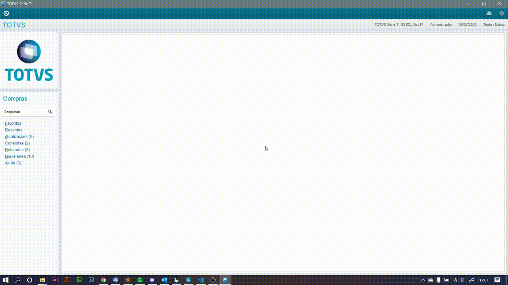
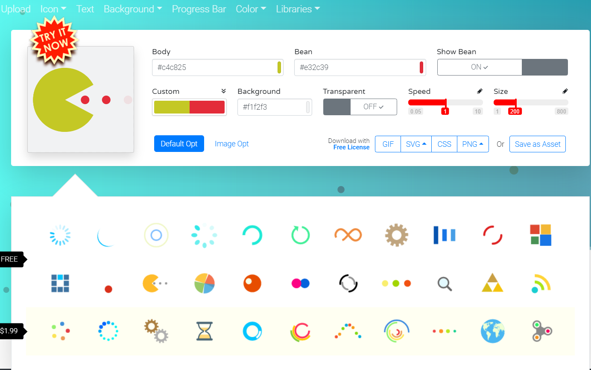

# Protheus-Janela-Processamento
Função Advpl  - Janela Processamento Customizada 

* Semelhante a função FwMsgRun()
* Possui 8 modelos de processamento além de permitir um SVG customizado. 
* Permite formatar em HTML a mensagem de processamento.
* Permite reposicionar o Load.

Observação: Exemplo de uso segue no próprio fonte.

Loading SVG foram retirados do site https://loading.io/

* Customize e adicione novos modelos.

## ?? Tecnologias

Esse projeto foi desenvolvido com a seguinte tecnologia:

- [Advpl](https://tdn.totvs.com/display/tec/AdvPL)
